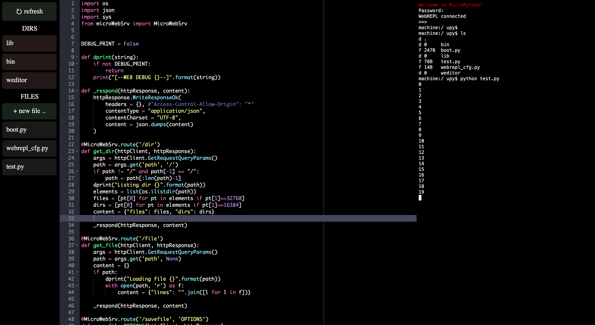

MicroPython web code editor / IDE
=================================

Web-based code editor for WiFi + MicroPython enabled microcontrollers

Uses Cloud9 Ace editor for code editing [Cloud9 Ace](https://ace.c9.io/)

Has an integrated WebREPL console

Developed and tested on ESP32, but should work on other boards too




Installation
------------

1. Flash a recent version (1.17+) of MicroPython to your Controller (http://micropython.org/download)
2. Copy contents of /weditor and lib/microWebSrv.py to the root of Controller's file system

```
$ cd micropython-web-editor
$ ampy --port /dev/ttyUSB0 put weditor /weditor
$ ampy --port /dev/ttyUSB0 put lib /lib
```

3. Setup WebREPL (optional)
On your Controller run:
```
import webrepl_setup
```

4. Update boot.py

```python
print("Activating network")
import network
wlan = network.WLAN(network.STA_IF)
wlan.active(True)
wlan.connect('YOUR_SSID', 'YOUR_PASS')

print("Starting webrepl")
import webrepl
webrepl.start()

print("Starting IDE web service")
import weditor.start
```

5. Reboot Controller
6. Open controller's IP in your browser (make sure to use http:// scheme - https not supported)
7. Have a nice day

Install shell for MicroPython (optional)
----------------------------------------

[MicroPython shell](https://github.com/vsolina/mipyshell)


Bundled open-source projects
----------------------------

*This project would not be possible without these exceptional projects*

[Cloud9 Ace code editor](https://github.com/ajaxorg/ace)

[MicroWebSrv](https://github.com/jczic/MicroWebSrv/)

[MicroPython's WebREPL](https://github.com/micropython/webrepl)

[And most importantly: MicroPython](https://github.com/micropython)


Notes
-----

* File saving does not work well with large files yet
* This editor was mostly written and debugged using itself
* esp8266 does not have enough RAM to run all required components (yet)
* When using the IDE, Internet connection is required because Ace is hosted on cdnjs (to reduce storage requirements)
*  but it's possible to bundle required ace.js files on Controller's flash (raise an Issue and I'll explain how to do it)
